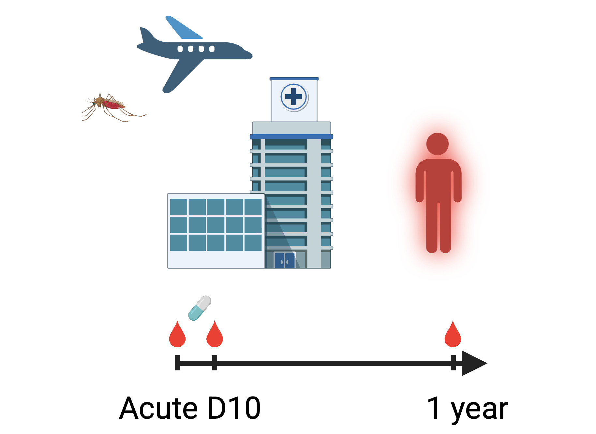

# [Integrated proteomics and single-cell transcriptomics reveal immune dynamics and severity markers in acute *Plasmodium falciparum* malaria](insert-link-to-publication)

Maximilian Julius Lautenbach, Katja Wyss, Victor Yman, Fariba Foroogh,
Donya Satarvandi, Zaynab Mousavian, Klara Sondén, Jun Wang, María Bueno
Álvez, Sofia Bergström, Peter Nilsson, Fredrik Edfors, Petter Brodin,
Mathias Uhlén, Christopher Sundling & Anna Färnert



## Abstract

Malaria can manifest as a spectrum of disease severity. To improve
clinical management and prevention, it is crucial to understand the
pathogenesis and host response. We analyzed 1,463 plasma proteins during
and after acute *Plasmodium falciparum* malaria in adult travelers and
linked responses to peripheral immune cells by integrating with
single-cell RNA-seq data from a subset of donors. We identified
significant perturbations in over 250 proteins with diverse origins,
including many not previously analyzed in malaria patients, such as
hormones, circulating receptors, and intracellular or membrane-bound
proteins from affected tissues. The protein profiles clustered
participants according to disease severity, which enabled us to identify
a compressed 10-protein signature that was highly enriched in more
severe malaria compared with mild malaria and other febrile infections.
This unique resource, which also includes an interactive platform to
explore the data, opens for new hypotheses, biomarker discovery, and
potential drug target identification for malaria.

The original publication can be accessed here: [Lautenbach *et. al* JOURNAL 2025](https://google.com)

## Table of contents

-   [General info about this repository](#general-info-about-this-repository)
-   [Dependencies](#dependencies)
-   [Data types](#data-types)
-   [Analysis scripts](#analysis-scripts)
-   [Data availability statement](#data-availability-statement)
-   [Repo overview](#repo-overview)
-   [Contact information](#contact-information)

## General info about this repository

This repository contains r code, related to the data analysis and
visualization described in the study.


## Dependencies

Project is created with:

-   R version 4.3.2 (2023-10-31)
-   Platform: aarch64-apple-darwin20 (64-bit)
-   Running under: macOS Sonoma 14.7.4
-   for more details, please see the `renv.lock` file

## Data types

The omics data included in this study:

-   Plasma protein abundance data (Olink Explore 1536 data)
-   Single-cell Ab and mRNA sequencing (BD Rhapsody data)
-   Clinical variables (variety of data)
-   Consensus tissue expression data from the Human Protein Atlas
-   Plasma protein abundance data from COVID-19 patients (Olink Explore 1536 data)
-   scRNA-seq data of PBMCs from malaria patients (10x data)

For access, please see the [Data availability statement](#data-availability).

## Analysis scripts 

### single cell multi-omics analysis to determine cell types and their gene expression

**insert script here.**

### Manuscript figures

All downstream data analysis, visualization and final main and supplementary figures can be found under as a [rendered html report](), and the markdown can be found [here]()
[Downstream_analysis_full_4repo.Rmd](https://SundlingLab/Explore1536_Malaria/Downstream_analysis_full_4repo).

## Data availability statement 

Due to patient consent and confidentiality agreements, the data sets can
be made available for validation or re-usage by contacting the lead
contact. Data access will be evaluated according to the data access plan
and Swedish legislation. Source data are provided in this paper. For the
individual exploration of the proteomic data, we created a Shiny app,
sourcing pre-computed aggregated data that can be browsed online at
malaria-proteomics-resource.serve.scilifelab.se. Moreover, measured
proteins are also visualized on the individual protein summary pages of
the Human Disease Blood Atlas, an initiative to characterize blood
protein profiles across a multitude of diseases Human Disease Blood
Atlas.

Request for data access can be made to Prof. Anna Färnert, Karolinska
Institutet, (for contact details, see the original study).

Additional data used:

- Consensus transcript expression level data set from the Human Protein
Atlas, summarizing expression per gene in 50 tissues based on
transcriptomics data from HPA and GTEx. Here, we used version 23.0 and
Ensembl version 109, retrieved [here](https://v23.proteinatlas.org/about/download).

- scRNA-seq data from PBMCs of individuals with *P. falciparum* malaria,
published by [Dooley *et al.* 2023](https://doi.org/10.1038/s41467-023-43181-7), has been accessed as a Seurat object under
[here](https://doi.org/10.5281/zenodo.6973241).

- Olink's Explore 1536 data from COVID-19-patients, published by [Filbin *et al.* 2021](https://doi.org/10.1016/j.xcrm.2021.100287), can be accessed [here](https://data.mendeley.com/datasets/nf853r8xsj/1).


## Repo overview 
<!-- -->

```         
project
│   README.md
│   renv.loc    
└───src
│   │   file1.Rmd
│   │   file2.Rmd
│   │   ...
|   └───md files (rendered versions of the Rmds)
│   |       │   file1.md
│   |       │   file2.md
│   |       │   ...
|   |
│   └───manuscript
│       │   Figure01.Rmd
│       │   Figure02.Rmd
│       │   ...
|       └───md files
│           │   Figure01.md
│           │   Figure02.md
│           │   ...
└───bin
│   │   file01.txt
│   │   file02.txt
└───data
│   │   file01.txt
│   │   file02.txt
│
```

## Contact information

For questions or inquiries, please contact:

Maximilian Julius Lautenbach
GitHub: [LautenbachMJ](https://github.com/LautenbachMJ)
